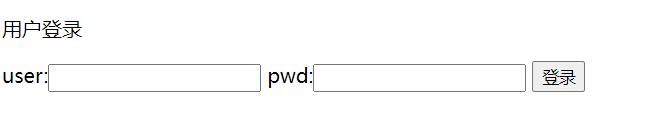
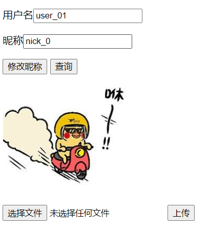
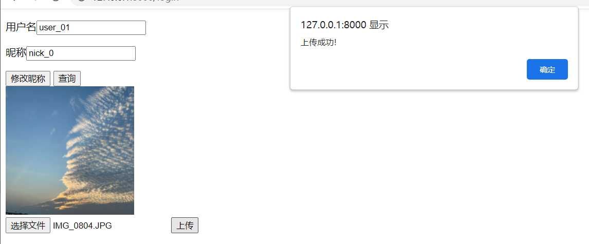

# go-entry-task

一个简单的用户管理系统，实现了用户登录、修改昵称、修改简历的功能，手动实现了简单的rpc功能

## 背景
入职shopee的新手任务，通过go http api，redis，mysql实现简单的用户管理系统。

要求：需要手动实现rpc调用功能，尽量不使用第三方库，例如gin框架等
实现功能：用户登录、修改昵称、修改简历图片

## 代码结构
- common:封装通用方法的库。
- httpserver:http请求服务器，用于处理用户的请求的api层,同时也是rpc的客户端
- protocol:rpc实现的协议结构体
- rpcsdk:手工实现的rpcsdk，暂不支持服务发现，客户端需要将服务器的ip填入。
- tcpserver:rpc调用的service层，与db、redis进行交互。

## 系统架构

## 功能展示

### 登录界面

用户登录界面展示

登录成功界面展示

(前端页面很丑)

### 修改图片功能

修改简历图片功能展示

## 后续优化

- 配置从代码中分离出，抽出成yml文件
- conn.Read\Write方法，一次读写可能无法将数据全部处理完，需要read\write直到eof
- rpc服务发现功能
- tcp连接实现心跳包

## 其他

服务器有性能上的要求，但是离职太匆忙，没有交接时间，之前的压测文档没有找到（呜呜呜）。后续可以在本地压测然后补上
